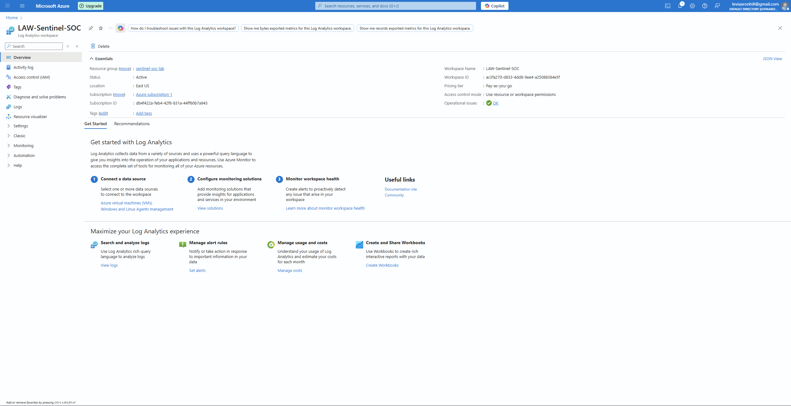
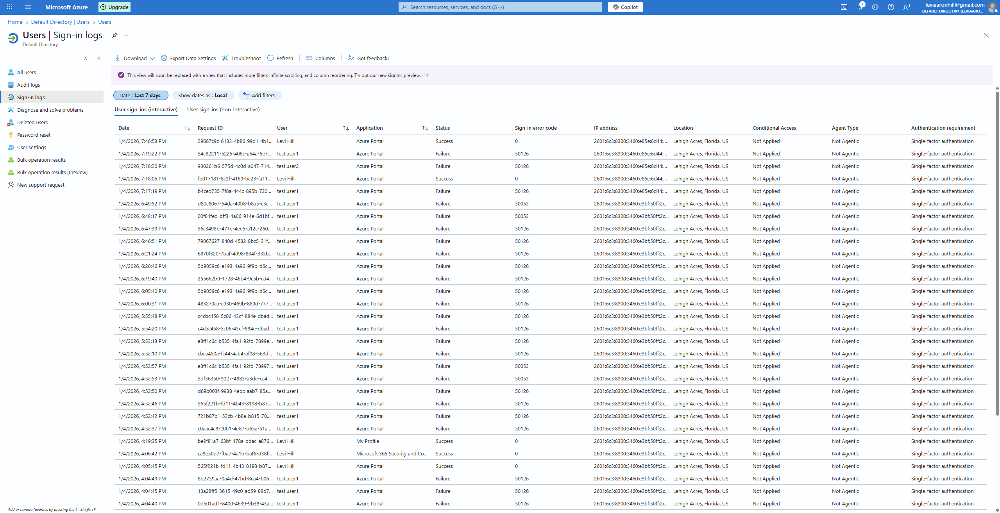
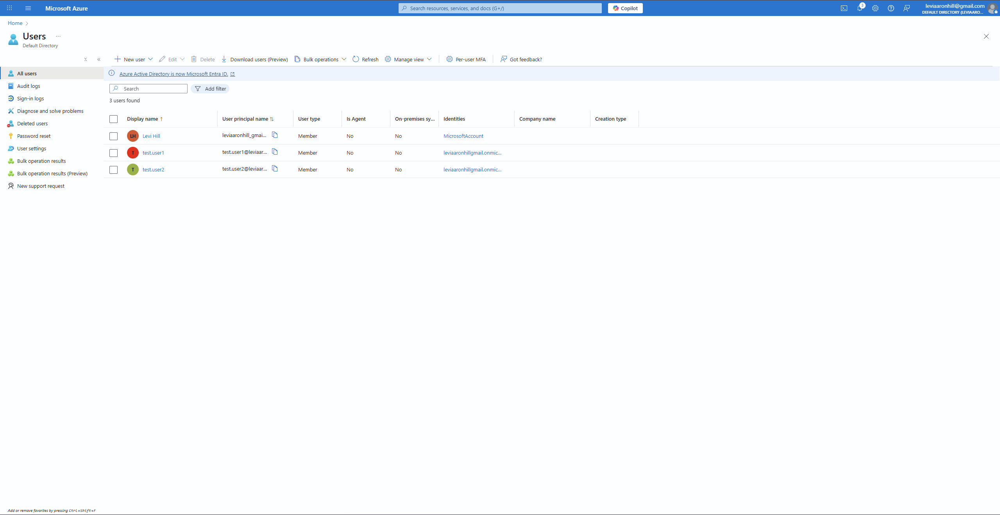
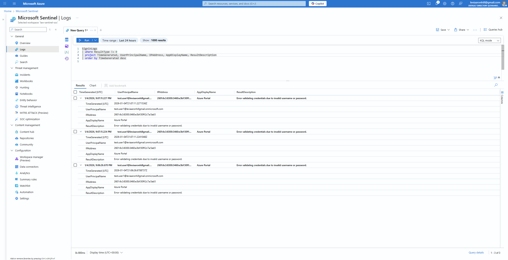
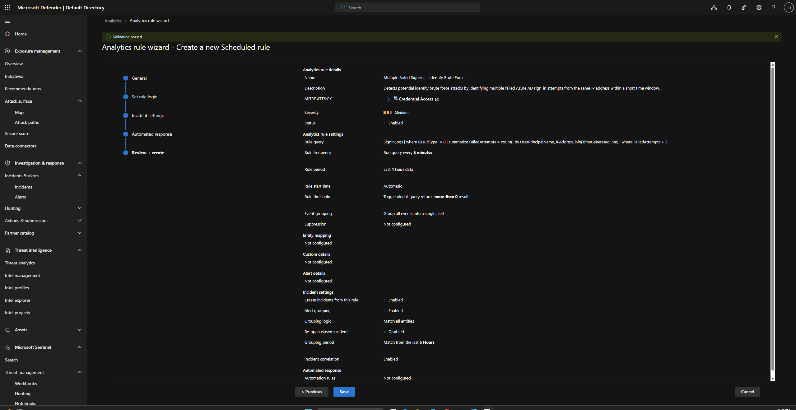
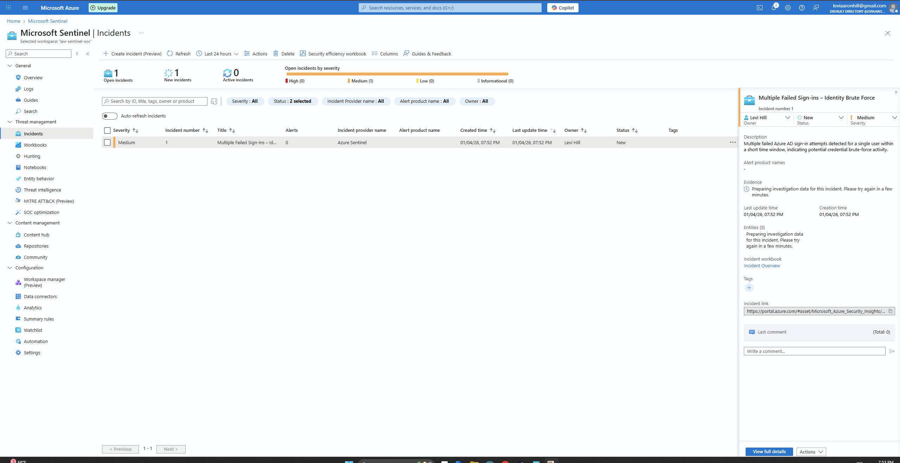
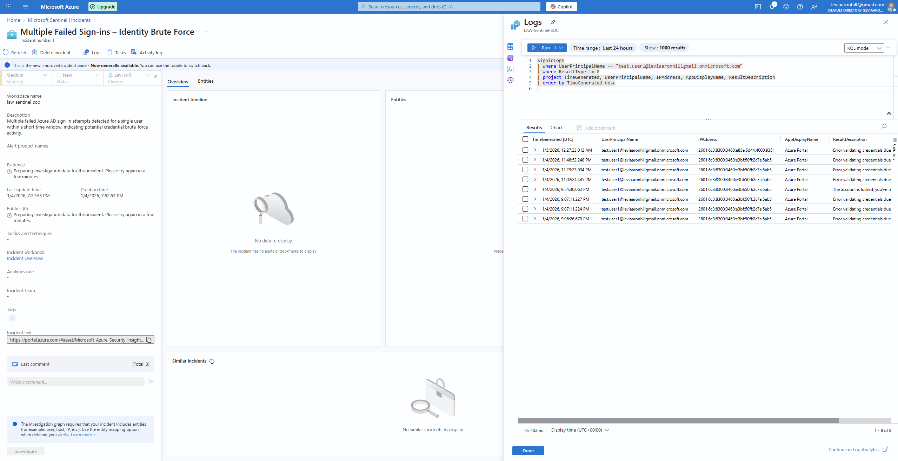
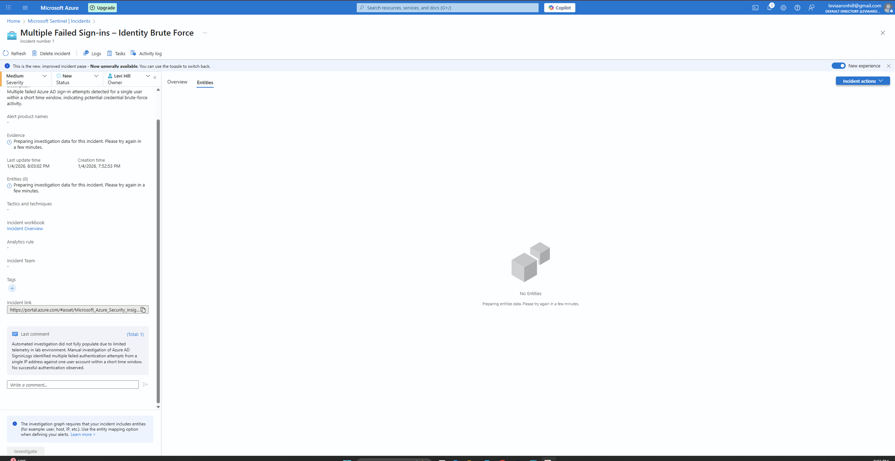
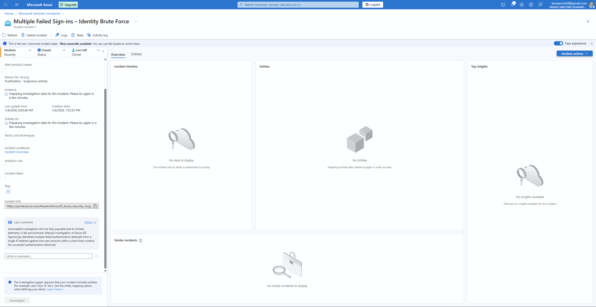

# Microsoft Sentinel – Identity Brute Force Detection Lab

## Overview
This lab shows how Microsoft Sentinel can be used to detect and investigate identity-based brute force and password spraying activity using Microsoft Entra ID (Azure AD) sign-in logs. The objective is to demonstrate how failed authentication behavior appears in Sentinel, how analytic rules surface suspicious activity, and how alerts are investigated from a SOC or Security Analyst perspective.

The focus is on practical detection, alert context, and investigation workflows rather than simply generating alerts.

---


## What This Lab Shows

- How identity brute force and password spray activity appears in Entra ID sign-in logs  
- How to create and validate a Sentinel analytic rule using KQL  
- What alert data is available for triage and investigation  
- Where detection works well and where gaps may exist  

---

## Environment & Tools

- Microsoft Sentinel  
- Microsoft Entra ID (Azure AD)  
- Log source: `SigninLogs`  
- Detection method: KQL-based analytic rule  
- Attack simulation: Manual failed sign-in attempts using invalid credentials  

---

## Lab Architecture

- Azure Log Analytics Workspace with Microsoft Sentinel enabled  
- Azure AD Sign-In Logs as the primary data source  
- Scheduled analytics rule triggering incidents  
- Sentinel incident investigation dashboard  

---

## Step 1: Enable Microsoft Sentinel
Microsoft Sentinel was enabled on a dedicated Log Analytics Workspace.

📸 **Screenshot:** Sentinel enabled on Log Analytics Workspace  


---

## Step 2: Connect Azure AD Sign-In Logs
The Azure Active Directory data connector was enabled to ingest sign-in logs.

📸 **Screenshot:** Azure AD data connector  


---

## Step 3: Create Test Users
Test users were created in Azure AD to generate authentication activity for detection testing.

📸 **Screenshot:** Test user creation  


---

## Step 4: Simulate Failed Sign-Ins
Multiple failed sign-in attempts were generated against the test user account to simulate identity brute force behavior.

📸 **Screenshot:** Failed sign-in activity  


---

## Step 5: Query Sign-In Logs with KQL
KQL was used to identify repeated failed sign-in attempts associated with a single user and IP address.

```kql
SigninLogs
| where TimeGenerated > ago(1h)
| where ResultType != 0
| summarize FailedAttempts = count() by UserPrincipalName, IPAddress
| where FailedAttempts > 3
```

---

## Step 6: Create Analytics Rule
A scheduled analytics rule was created in Microsoft Sentinel using the validated KQL query to detect identity brute-force activity.

**Rule Configuration Details:**
- Rule type: Scheduled
- Severity: Medium
- Query frequency: Every 5 minutes
- Lookup period: Last 1 hour
- Alert threshold: Greater than 0 results
- Incident creation: Enabled
- Alert grouping: Enabled

📸 **Screenshot:** Analytics rule configuration  


---

## Step 7: Generate Sentinel Incident
After triggering multiple failed sign-in attempts, Microsoft Sentinel automatically generated an incident based on the analytics rule. Related events were grouped into a single incident for investigation.

📸 **Screenshot:** Sentinel incident generated  


---

## Step 8: Incident Investigation
The incident was investigated by reviewing:
- Azure AD sign-in logs
- Affected UserPrincipalName
- Source IP address
- Application involved in authentication attempts
- Result descriptions indicating invalid credentials

Additional KQL queries were used to confirm the scope and frequency of the activity.

📸 **Screenshot:** Incident investigation with logs  


---

## Step 9: Analyst Notes and Validation
Analyst notes were added to document findings and validate the incident as a true positive.

The investigation confirmed:
- Multiple failed authentication attempts
- A single targeted user account
- No successful authentication observed

📸 **Screenshot:** Analyst comments and evidence  


---

## Step 10: Incident Closure
The incident was closed with the classification True Positive – Suspicious Activity, completing the SOC workflow from detection through resolution.

📸 **Screenshot:** Incident closed  


---

## Key Takeaways
- Microsoft Sentinel can detect identity-based attacks using Entra ID telemetry
- KQL enables precise detection engineering for authentication threats
- Analytics rules automate alerting and incident creation
- This lab mirrors real-world SOC analyst investigation and response workflows

---

## Future Improvements
- Implement automated responses using Logic Apps
- Add password spray detection rules
- Incorporate MFA-based detections and impossible travel alerts

---

## Author
**Levi Hill**  
